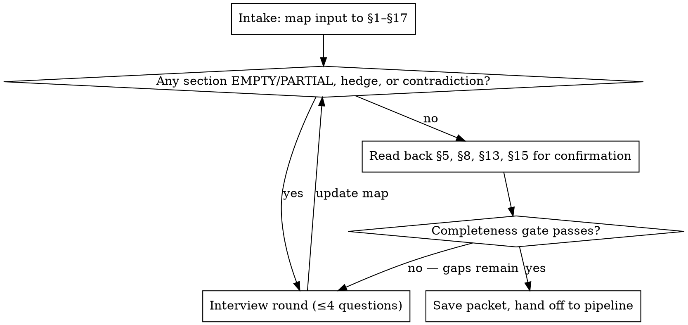

# Creating the Stakeholder Input Packet

## Overview

The packet (template: `templates/stakeholder-input-packet.md`, sections §1–§17) is the sole source of business truth for the entire agent pipeline. Core principle: **nothing enters the packet that the stakeholder did not say or explicitly confirm.** This skill extracts the packet through an interview. It never authors business truth — a drafted rule the stakeholder never confirmed is corrupted input that every downstream agent will faithfully build on.

## When to Use

- New project: the idea exists only in someone's head, chat messages, or a short brief.
- An existing packet draft has `OPEN` items, hedges ("maybe", "I think"), or contradictions to resolve.

**Do NOT use for:**
- A complete, confirmed packet → invoke the `delivery-orchestrator` agent directly.
- A mid-run scope change → write a packet **amendment** per the Agent Handoff Protocol §3.3. Never edit the frozen copy under `runs/<run-id>/00-packet/`, never restart the interview.

## The Interview Loop

## Phase 1 — Intake & Mapping

1. Read the template `templates/stakeholder-input-packet.md` in full first — its prompts AND its worked example set the expected level of detail.
2. Collect whatever input exists. Quote-map every stakeholder statement to a section §1–§17.
3. Mark each section: **FILLED** = its template prompt could be answered without further asking; **PARTIAL** = statements map to it but fall short of the template's detail; **EMPTY** = nothing maps. List every hedge and contradiction separately — each must be resolved by a question, never hardened into a fact.
4. Persist the map, the hedge/contradiction lists, and the pending question queue to `packet-interview-state.md` next to the intended packet destination. This file is working state, never the packet; resume an interrupted interview from it. An unconfirmed packet is never saved as the packet — if the stakeholder becomes unavailable, the work stays in this file.

## Phase 2 — Interview Rounds

- **≤4 questions per round.** Plain language only — the stakeholder is non-technical; no schema/auth/API vocabulary.
- Use `AskUserQuestion` when available (concrete options + free-text always possible); otherwise numbered questions in chat.
- **Priority order:** §1–§5 (identity, roles, journeys, features, rules) → §6–§9 (data, touchpoints, permissions, privacy) → §10–§15 → §16–§17.
- One topic per question. Show the expected detail level by borrowing from the template's worked example.
- "I don't know" is a valid answer → mark `OPEN` with enough context for the Requirements Analyst to form a clarification question. **`OPEN` is permitted only after the stakeholder was actually asked.**
- Convert every relative date to an absolute date (today + offset). Collect domain words for §17 as they appear.
- Money, identity, and irreversibility hide the biggest gaps: if anything is charged, paid, refunded, deleted, or restricted, drill until the rule is a single testable sentence (amount, boundary moment, who can override).

Per-section question bank and gap probes: see interview-guide.md in this directory.

## Phase 3 — Draft & Read-Back

Draft each section in the stakeholder's own words. Then read back **verbatim for explicit confirmation** the four normative sections:

| Section | Becomes |
|---|---|
| §5 Business Rules | system invariants + automated safety tests |
| §8 Permissions | the enforced permission matrix |
| §13 Acceptance Examples | the release gate |
| §15 Out of Scope | orphan detection; unlisted = excluded by default |

A "yes, that's right" from the stakeholder is required per section. Unconfirmed drafts of these sections may not ship in the packet.

When you reword a vague answer into a testable sentence (common for §5 rules and §13 examples), the reworded sentence you read back and the stakeholder confirms **becomes** their wording. §17 glossary definitions are confirmed the same way.

## Phase 4 — Completeness Gate

All must hold before saving:

- [ ] All 17 sections present; each FILLED or carrying explicit `OPEN` items.
- [ ] §2: every role has who / approximate count / needs. §8 covers **every** §2 role with can / can-never.
- [ ] §3: 3–7 journeys, each with at least one thing-goes-wrong path.
- [ ] §4: every feature tagged MUST / SHOULD / LATER. No effort or time estimates anywhere in the packet (an absolute deadline date in §14 is a constraint, not an estimate).
- [ ] §5: each rule is one testable plain sentence.
- [ ] §13: 5–10 concrete, checkable statements.
- [ ] §16: a named human decision-maker with response expectations.
- [ ] No unconfirmed hedges, no relative dates, every contradiction resolved or `OPEN`.
- [ ] Spot-check against the template's traceability appendix: each section's consuming agents could act on what is written.

## Phase 5 — Save & Hand Off

1. Confirm the file destination with the operator running the session. Default: `runs/<yyyy-mm>-<project-slug>/00-packet/stakeholder-input-packet.md` (the frozen copy per the Agent Handoff Protocol §1). Content confirmations always come from the stakeholder; file-location and process confirmations come from the operator — these may be different people.
2. Delete or archive `packet-interview-state.md` once the packet is saved.
3. Recommend the next step: invoke the `delivery-orchestrator` agent for a full run, or the `requirements-analyst` agent directly for a packet dry-run before committing to a run.

## Common Mistakes

| Mistake | Reality |
|---|---|
| Drafting the whole packet from the brief, flagging gaps as `OPEN` without asking | That is the Requirements Analyst's failure mode inverted. This skill exists to ASK. `OPEN` only after the question was put to the stakeholder. |
| Hardening hedges ("maybe WhatsApp" → "WhatsApp notifications: MUST") | A hedge is a question, not a decision. Ask, or carry the hedge as `OPEN`. |
| Inventing journeys, permissions, or acceptance examples "as a starting point" and moving on | Proposing options inside a question is fine. Recording them as packet content without a "yes" is fabrication. |
| Firehosing 15 questions at once | Stakeholders abandon long questionnaires. ≤4 per round, highest-priority gaps first. |
| Leaving "in three months" in the packet | Downstream agents cannot resolve it. Write the absolute date. |
| Treating "I don't know" as failure | It is signal. Mark `OPEN`; the analyst batches it for the decision-maker. |
| Skipping the read-back because answers were clear | §5/§8/§13/§15 become tests, gates, and enforcement. Confirmation is the contract. |

## Red Flags — Stop and Return to the Loop

- You are writing a §5 rule or §8 permission the stakeholder never stated.
- You are about to save with a section you never asked about.
- A question round contains technical vocabulary.
- "The example packet had X, so this project probably needs X too" — the worked example calibrates detail, it does not supply content.
